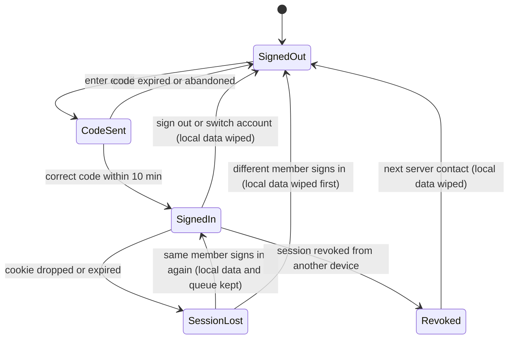
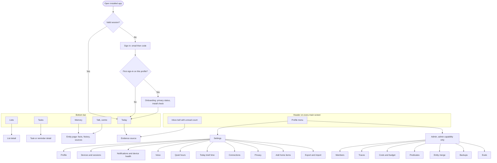
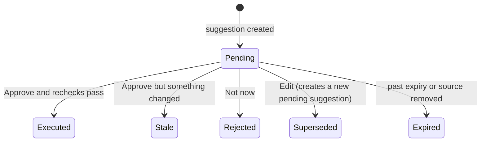

# 28 — Application Flows: Nilumi (MVP)

> **Status:** Draft for Phase 1 review · **Date:** October 10, 2026 · Plan reviewed independently by three model reviewers before writing
> **Related:** [01 Product Plan](01-product-plan.md) · [02 Architecture](02-architecture.md) · [05 Implementation Roadmap](05-implementation-roadmap.md) · [ADR catalogue](../adr/README.md) · [ADR-053](../adr/adr-053.md) · [ADR-054](../adr/adr-054.md) · [ADR-055](../adr/adr-055.md)
> **October 10 owner decisions:** navigation and the Phase 1 Today placeholder (from research), withdrawal stops every AI provider call, app at `app.nilumi.in`, invitation emails, the lost-mailbox limitation and Phase 1 email change. See [§9.2](#92-resolved-questions).

---

## 1. Purpose, ownership and conventions

This document describes **how Nilumi works from the user's side**: how people sign in, which screens exist, what each screen is for, and what happens in each workflow, including positive, negative, edge and error scenarios. It covers the MVP, Phases 1–6A and journeys J1–J20.

It is functional only. Visual design, layout and components are out of scope; the only assumption is that the PWA uses **shadcn/ui** and **Tailwind CSS**.

| This document owns | Owned elsewhere |
|---|---|
| Screen inventory and purpose; flow steps; scenario catalogue; user-visible permission summary; flow-level open questions | Requirements and acceptance criteria ([Product §8](01-product-plan.md#8-core-journeys-and-acceptance-criteria)); technical contracts ([Architecture](02-architecture.md)); delivery order ([Roadmap](05-implementation-roadmap.md)); accepted decisions ([ADRs](../adr/README.md)) |

If this document disagrees with an owning document, the owning document wins and the difference is logged in [§9](#9-assumptions-open-questions-and-dependencies).

### 1.1 Tags

- **Phase:** `P1`–`P6A` from the Roadmap. Tags apply to **capabilities**, not whole flows, because most flows grow over several phases.
- **Priority:** `Must`, `Should` or `Could`, from [Product §9](01-product-plan.md#9-scope). A Should or Could item is never a phase completion requirement.

### 1.2 Scenario IDs

`AREA-Xn`, where `X` is the scenario type. IDs are stable: new scenarios are appended and IDs are never reused.

| Type | Meaning |
|---|---|
| `P` | Positive: the intended path succeeds |
| `N` | Negative: the user is not allowed, the input is refused, or the request can't be satisfied |
| `E` | Edge: an unusual but legitimate situation (timing, concurrency, partial data, device behavior) |
| `X` | Exception: a system or provider failure specific to this flow. Failures shared by every flow are in [§6](#6-error-and-degraded-mode-matrix) |

| Area | Flow |
|---|---|
| `BOOT` | [Household bootstrap and member administration](#51-boot--household-bootstrap-and-member-administration) |
| `AUTH` | [Sign-in and sessions](#52-auth--sign-in-and-sessions) |
| `ONB` | [Progressive onboarding](#53-onb--progressive-onboarding) |
| `SEC` | [Devices, lost phone, email change and step-up](#54-sec--devices-lost-phone-email-change-and-step-up) |
| `ACK` | [Household privacy acknowledgement](#55-ack--household-privacy-acknowledgement) |
| `TODAY` | [Today](#56-today--landing-screen-and-daily-brief) |
| `APPR` | [Approving suggestions](#57-appr--approving-editing-or-rejecting-a-suggestion) |
| `TALK` | [Talk turn](#58-talk--a-voice-or-text-turn) |
| `MEM` | [Memory capture and lifecycle](#59-mem--memory-capture-correction-forget-and-sharing) |
| `ASK` | [Questions and the Memory screen](#510-ask--questions-inspection-and-the-memory-screen) |
| `LIST` | [Lists](#511-list--shopping-list-and-lists) |
| `TASK` | [Tasks and reminders](#512-task--tasks-and-reminders) |
| `NOTIF` | [Notifications and Inbox](#513-notif--notifications-and-inbox) |
| `SET` | [Settings](#514-set--settings) |
| `CAL` | [Calendar connection](#515-cal--google-calendar-connection) |
| `ADMIN` | [Admin](#516-admin--admin-screens) |

### 1.3 Words used here

- **Card:** a result shown after an action (memory saved, item added, reminder scheduled, answer, suggestion). Card content is defined in [Product §7](01-product-plan.md#7-experience-overview-pwa).
- **Badge:** the visibility label on every memory card: `🏠 Household`, `👥 Shared` or `🔒 Private`.
- **Evidence chip:** a link from an answer or Today item to its source.
- **The owner:** the founding adult who runs the bootstrap script and holds the first admin capability.

---

## 2. Actors, roles and global states

### 2.1 Actors

| Actor | Can sign in | Notes |
|---|---|---|
| **Adult member** | Yes | Full use of the app. Each adult has private data that the other adult can't see |
| **Admin capability** | Held by an adult | A capability, not a separate user. Both adults may hold it. It never widens what an adult can **see**; it adds member management and operational views ([Architecture §15.2](02-architecture.md#152-row-level-security)) |
| **Child** | No (MVP) | A member profile that facts and reminders can be **about**. Kid mode is H5 |
| **External person** (plumber Ravi, Dr. Meena) | No | Stored as an entity, never a user |
| **Schedule / routine** | n/a | Starts work on a member's behalf (reminder delivery, Today brief). It acts with exactly that member's visibility |

### 2.2 Session states

The key distinction: **losing a session keeps the device's local lists, tasks, inbox and queued changes** for the same member; **signing out, switching account or being revoked wipes them** ([Architecture §13.1](02-architecture.md#131-client-sync-offline-data-and-lists), [§15.5](02-architecture.md#155-authentication-sessions-and-recovery)).

### 2.3 Connectivity states

| State | What the user sees | What works |
|---|---|---|
| Online | Normal | Everything |
| Realtime stale | "Reconnecting…" indicator | Everything; screens refresh on focus and reconnect |
| Offline (or server down) | Offline banner; "N changes waiting" when changes are queued | Lists, Tasks and Inbox from the device cache, with changes queued. Today, Talk, Memory, Settings and Admin show an offline state |

### 2.4 Household AI states

These states decide how Talk, answers and the Today summary behave. Lists, tasks, reminders and the inbox work in **every** state.

| State | Cause | Model calls | User experience |
|---|---|---|---|
| **Normal** | Acknowledgement active, under budget | Allowed | Full experience |
| **Soft cap** | AI spend ≥ 80% of the monthly AI budget | NLU allowed; answers use templates | Answers show evidence cards without a synthesized sentence; speech uses cached phrases only; Today summary skipped |
| **Hard cap** | AI spend ≥ 100%, gateway budget or credit exhausted, or no compliant route | None | Talk understands a small fixed set of commands (add to list, read the list, remind me, undo). Everything else: "I can't think right now; I've saved your words in your inbox." Admin is alerted |
| **Acknowledgement inactive** | Never recorded, withdrawn, outdated notice or changed adults | **None of any kind**: no language-model, embedding, speech-to-text or text-to-speech call ([ADR-054](../adr/adr-054.md)) | Banner explaining why. The mic shows "Voice is paused"; typed text works in the fixed command set; no spoken replies. New calendar links are refused; an existing connection keeps showing events |
| **Model outage** | Provider down | None | Same as hard cap. In the restricted pilot there is **no fallback model** ([ADR-052](../adr/adr-052.md)) |

Calls already sent to a provider when the acknowledgement is withdrawn can't be recalled; everything not yet sent, including queued background work, stops.

---

## 3. Cross-cutting rules

### 3.1 How changes are confirmed

| Mechanism | When | User action |
|---|---|---|
| **Undo** | A clear request the member made directly ("remember…", "add…", "remind me…") | Applied immediately; the card offers Undo and Edit. Undo works for 24 hours and only if nobody has changed the item since |
| **Confirm** | Health and allergy facts; forget (can't be undone); sharing a memory that would reveal a private entity's name and type | An explicit tap before the change becomes active |
| **Approve** | Something Nilumi suggests on its own (Today suggestions) | Approve, Edit or Not now; nothing runs until approved |
| **Clarify** | Deterministic ambiguity only: two matching entities, an ambiguous date, several matching memories, a missing reminder time, a time already in the past | Answer within 5 minutes in the next turn |

Nilumi never asks because of vague "confidence", and never describes something as done unless it was saved.

### 3.2 Privacy rules every screen follows

- Every memory card shows one visibility badge.
- **Existence is private too.** Another adult's private items never appear in answers, counts, autocomplete, suggestions, notifications, Today or evidence chips. "Not found" looks the same as "doesn't exist".
- Evidence opened by another adult shows only the evidence span on the memory, never the speaker's whole original turn.
- Secrets are refused on **every** input, not just Talk: typed and spoken turns, card edits, list and task notes, seeding forms, imports and feedback notes. The reply is "That sounds sensitive, so I won't store it." and nothing is saved ([Architecture §15.3](02-architecture.md#153-sensitive-input-boundary-before-persistence-and-before-the-llm)).
- Calendar events are private to the adult who connected the calendar and are never memories.

### 3.3 Permission summary

| Item | Who can see it | Who can change it | Notes |
|---|---|---|---|
| Household memory | Both adults | Either adult: edit, correct, forget | Already visible to both, so there is nothing to share |
| Shared memory | Both adults | **Owner only**: edit, forget, un-share | The other adult can cite it, or create a separate household value |
| Private memory | Owner only | Owner only, including Share | Existence hidden from the other adult |
| Original transcript | The speaker only | — | Others see only the evidence span on a memory |
| Household list or task | Both adults | Either adult | |
| Private list or task | Owner only | Owner only | |
| Reminder | Creator and targets (both adults if household) | Creator edits or cancels the schedule | Targets see "from Nishanth". What targets can do is [OQ-13](#93-open-questions) |
| Inbox, notification devices | Own only | Own only | |
| Today brief | Own only | — | No admin view |
| Suggestion (approval) | The member it belongs to only | That member only | Others get "not found" |
| Calendar connection and events | Own only | Own only | The other adult can't tell whether a connection exists |
| Turn traces | Own: full. Admin: timings, outcomes and costs of others, **no text** | — | Admin is not a privacy bypass |
| Household acknowledgement | Every adult | Admin records; any covered adult withdraws; after a withdrawal only the withdrawing adult can record again | |
| Member management | Admin | Admin. No self-grant; the last admin can't be removed; no changing another adult's email after their first sign-in; no impersonation | |
| Predicate registry | All adults | Admin | |
| Export | Requester | — | Household data plus the requester's own private and shared-owned data |

### 3.4 Step-up

A second check (Face ID or fingerprint if enabled, otherwise a fresh email code) is required before **export**, **viewing private items after inactivity** and **forget-all**. A successful check lasts 10 minutes ([AS-9](#91-assumptions)).

### 3.5 Retries and double taps

Every action is safe to repeat. A retried voice or text turn replays what already happened and finishes only what didn't. A double-tapped approval runs once. A queued offline change is applied once.

### 3.6 Time

Everything runs in Asia/Kolkata. Vague times use household defaults (morning 09:00, afternoon 14:00, evening 18:30, tonight 20:30, weekend Saturday 10:00), and cards always show the resolved time ([ADR-029](../adr/adr-029.md)). Dates are day-first ("3/4" is 3 April). Stored dates keep their precision, so "we bought it in 2020" is never shown as "1 Jan 2020".

### 3.7 Notification tap targets

| Notification | Opens |
|---|---|
| Reminder | That reminder in the app (Android may also offer Done/Snooze actions, a Could item) |
| Today brief | Today |
| Test push | Notification health |

---

## 4. Screen map

### 4.1 Navigation

Decided October 10 for development from the research in [Research: October 10 application-flow research](../research/04-research.md#october-10-application-flow-research). It can change after the adults use it.

- **Bottom bar with five destinations: Today, Lists, Talk, Tasks, Memory.** Apple and Material both recommend 3–5 top-level destinations in a bottom bar, with labels always visible; more than five means a "More" overflow that hides content.
- **Talk sits in the centre** because Nilumi is voice-first and the centre is the easiest place to reach with a thumb. Opening Talk puts the mic ready to hold; the text box is always there. A tab bar is for navigation, not actions, so Talk is a destination (the conversation) rather than a bare record button.
- **Inbox is a bell in the header with an unread count**, not a tab. Its items also surface in Today (P6A) and Tasks, so it is a secondary destination. The count keeps it discoverable, which matters because hidden navigation is found and used less.
- **Settings and Admin are in a profile menu** in the header. They are used rarely; Admin appears only for adults with the admin capability.
- **Tabs appear as their phase ships**, and are never shown disabled:

| Phase | Bottom bar | Header |
|---|---|---|
| P1 | Today, Talk | Profile menu |
| P2 | Today, Lists, Talk | Profile menu |
| P3–P4 | Today, Lists, Talk, Memory | Profile menu |
| P5 onward | Today, Lists, Talk, Tasks, Memory | Inbox bell, profile menu |

- **Deep links** from notifications and evidence chips open the target screen with its tab selected, so Back returns to that tab.

### 4.2 Screen inventory

| Screen | Purpose | Main functions | Phase · priority | Offline |
|---|---|---|---|---|
| **Sign in** | Get into the app | Enter email, enter 6-digit code, switch account | P1 · Must | Not available |
| **Onboarding** | One-time setup that matches what has shipped | Privacy status, install check; later: notifications, home items, brief time, calendar offer | P1 basic; grows P2–P6A | Not available |
| **Today** | Daily landing screen | P1: placeholder ([§5.6](#56-today--landing-screen-and-daily-brief)). P6A: personal brief with evidence chips, suggestions, calendar state, optional summary line | P1 placeholder · P6A brief · Must | Offline state |
| **Talk** | Say or type anything | Hold or tap to talk, text box, transcript, result cards, answers with evidence, spoken replies, Undo/Edit | P1 echo · P2 commands · P3 answers · P5 reminders · P6 voice modes | Offline state |
| **Lists** | Shared shopping list, plus custom lists later | Add, tick, remove, quantities, who added, realtime sync, offline use | P2 · Must; custom lists Could | **Works offline** |
| **Tasks** | Upcoming and overdue tasks and reminders | Mine/ours filter, Done, Snooze, Reschedule, Edit, Cancel | P5 · Must | **Works offline** |
| **Memory** | "What we know" | Browse by category, search, entity pages with facts, badges, sources, history, card actions | P3 browse and search · P4 history and merge · Must | Offline state |
| **Inbox** | Things needing attention, opened from the header bell | Delivered reminders, failed deliveries, suggestions, saved-but-not-done requests, items needing confirmation | P5 · Must (items added by later phases) | **Works offline** |
| **Settings** | Personal and household settings | See [SET](#514-set--settings) | P1 core; sections by phase | Offline state |
| **Admin** | Household operation | Members, traces, costs, predicates, entity merge, backups, evals | P1 members, traces, backups, evals · P2 predicates · P4 merge · P6 costs | Offline state |

---

## 5. Flows

Flows with real state changes (AUTH, ACK, TODAY, APPR, TALK, MEM, LIST, TASK, CAL) have a main path and a full scenario table. The others are summarized as capabilities plus scenarios. Every flow lists only its own failures; shared failures are in [§6](#6-error-and-degraded-mode-matrix).

### 5.1 BOOT — Household bootstrap and member administration

**Purpose:** create the founding household and manage who belongs to it. Membership is invite-only ([ADR-023](../adr/adr-023.md)); there is no sign-up and no in-app household setup ([ADR-053](../adr/adr-053.md)).

| Capability | Phase · priority | How |
|---|---|---|
| Create household and first admin | P1 · Must | **Owner-only command-line script** run against the production database: household name, time zone `Asia/Kolkata`, founding adult's name and email, admin capability. Not reachable over HTTP |
| Add an adult | P1 · Must | Admin → Members → Add adult: display name, sign-in email (allowlisted), relationship to existing members (for example spouse), admin capability on or off |
| Invitation email | P1 · Must | Saving a new adult sends an email from `no-reply@nilumi.in`: who invited them, a plain link to `https://app.nilumi.in`, how to install the app on iPhone and Android, and "sign in with this email address; we'll send you a code". It contains **no sign-in link or token** (magic links stay disabled, [ADR-023](../adr/adr-023.md)). The admin can resend it until the adult first signs in ([ADR-053](../adr/adr-053.md)) |
| Add a child profile | P1 · Must | Admin → Members → Add child: name, relationship (child of which adults). No email, no sign-in |
| Relationships | P1 · Must | Set when adding a member; editable by an admin. Needed so "my wife", "my husband" and "our son" resolve ([Architecture §11.2](02-architecture.md#112-speaker-relative-references-resolved-before-entity-lookup)) |
| Grant or remove admin | P1 · Must | Admin → Members; audited |
| Correct an email before first sign-in | P1 · Must | Admin → Members. After the member's first sign-in only the member can change it ([SEC](#54-sec--devices-lost-phone-email-change-and-step-up)) |
| Remove a member | Not in MVP UI | [OQ-14](#93-open-questions) |

| ID | Scenario | Outcome |
|---|---|---|
| BOOT-P1 | Owner runs the script on an empty database | Household and admin created; the owner signs in with an email code ([AUTH](#52-auth--sign-in-and-sessions)) |
| BOOT-P2 | Admin adds the spouse with email and relation "spouse" | She receives the invitation email, installs from `app.nilumi.in` and signs in with a code; "my wife" and "my husband" resolve |
| BOOT-P3 | Admin adds two children | They appear as people facts and reminders can be about; they can't sign in |
| BOOT-P4 | Admin grants admin to the other adult | Both hold admin; both see Admin |
| BOOT-N1 | Script is run again when a household exists | Refused; nothing changes |
| BOOT-N2 | A non-admin opens an Admin link | Not found; Admin isn't shown in navigation |
| BOOT-N3 | The only admin removes their own admin capability | Refused: "There must be at least one admin." |
| BOOT-N4 | An adult tries to give themselves admin | Not possible: only an existing admin can grant it |
| BOOT-N5 | Admin enters an email another member already uses | Refused |
| BOOT-N6 | Admin tries to change another adult's email after that adult has signed in | Refused, with an explanation that the member changes it themselves |
| BOOT-E1 | A new adult is added after the household acknowledgement was recorded | The acknowledgement no longer covers every adult, so model features pause for the household until it is recorded again ([ACK-E2](#55-ack--household-privacy-acknowledgement)) |
| BOOT-E2 | No spouse relationship is set and someone says "my wife prefers…" | The reference can't resolve; Talk asks who is meant and suggests an admin sets the relationship |
| BOOT-E3 | An invited adult never signs in | The profile stays; the admin can correct the email and resend the invitation |
| BOOT-E4 | Admin corrects the email of an adult who hasn't signed in yet | A fresh invitation goes to the new address; the old address can no longer be used to sign in |
| BOOT-X1 | The invitation email can't be sent | The member is still saved; Members shows "Invitation not sent" with Resend |

### 5.2 AUTH — Sign-in and sessions

**Purpose:** let an allowlisted adult sign in inside the installed app, stay signed in, and recover safely. All P1 · Must.

**Main path**
1. Open the app installed from `https://app.nilumi.in` ([ADR-055](../adr/adr-055.md)). With a valid session, go straight to Today.
2. Otherwise, on Sign in, enter an email.
3. Nilumi always replies "If this email is registered, we've sent a code", whether or not it is registered.
4. Enter the 6-digit code from the email (valid for 10 minutes) inside the app.
5. A 90-day sliding session starts. First sign-in on this profile goes to [Onboarding](#53-onb--progressive-onboarding); otherwise to Today.

| ID | Scenario | Outcome |
|---|---|---|
| AUTH-P1 | First sign-in on the installed app | Signed in; onboarding starts |
| AUTH-P2 | App reopened days later | Still signed in; the 90-day period restarts with use |
| AUTH-P3 | Sign in on a second phone or laptop | Both sessions active and listed in Devices |
| AUTH-P4 | Session is lost (for example, iOS drops the cookie) and the **same** adult signs in again | Local lists, tasks, inbox and queued changes are kept and sync once |
| AUTH-P5 | Sign out | This device's local data is wiped; Sign in is shown |
| AUTH-N1 | Unregistered email | Same generic reply; no code is sent; nothing reveals whether the email exists |
| AUTH-N2 | Wrong code | "That code didn't work." Repeated failures are rate-limited with a generic message |
| AUTH-N3 | Code older than 10 minutes | "That code has expired. Request a new one." |
| AUTH-N4 | Too many code requests | "Too many attempts. Try again in a few minutes." |
| AUTH-N5 | A **different** adult signs in on this device | The previous adult's local data is wiped first. If they have unsynced changes, see [OQ-6](#93-open-questions) |
| AUTH-E1 | The user switches to the mail app and comes back | The code still works within 10 minutes |
| AUTH-E2 | Two codes requested | Only the latest code works ([AS-12](#91-assumptions)) |
| AUTH-E3 | Session lost while offline | Cached lists, tasks and inbox stay usable and changes queue; Sign in is offered when back online |
| AUTH-E4 | A new app version is available | The session is kept; the app offers to reload; queued changes from the previous version are still accepted |
| AUTH-E5 | This device's session is revoked from another device | At the next server contact the app signs out and wipes local data ([AS-8](#91-assumptions)) |
| AUTH-E6 | Signed in from a browser tab instead of the installed app | Works; iPhone push and reliable audio need the installed app ([ONB](#53-onb--progressive-onboarding)). Desktop use is [OQ-21](#93-open-questions) |
| AUTH-X1 | The email service fails | "We couldn't send a code right now. Try again." No account information is revealed |

### 5.3 ONB — Progressive onboarding

**Purpose:** set up only what the current release can use. Steps from later phases appear **once**, the first time the app opens after they ship, can be skipped, and are always available in Settings.

| Step | Shown from | What happens |
|---|---|---|
| Privacy status | P1 · Must | Shows the household notice, who recorded the acknowledgement and when. If it isn't active, explains that AI features are paused and how it gets recorded ([ACK](#55-ack--household-privacy-acknowledgement)) |
| Install check | P1 · Must | If the app is not running from the Home Screen, explains how to install it from `app.nilumi.in`. On iPhone, push notifications need it |
| Microphone permission | P1 · Must | Not asked during onboarding; asked the first time the adult uses Talk ([AS-14](#91-assumptions)) |
| Add home items | P2 · Must | Offers the seeding form ([SET](#514-set--settings), J12) |
| Notifications | P5 · Must | Asks for permission from inside the installed app, then sends a test push |
| Quiet hours | P5 · Should | Confirms the default quiet hours ([OQ-18](#93-open-questions)) |
| Today brief time | P6A · Must | Confirms the brief time |
| Calendar | P6A · Must, after S-GCAL | Offers the optional Google Calendar connection ([CAL](#515-cal--google-calendar-connection)) |

| ID | Scenario | Outcome |
|---|---|---|
| ONB-P1 | P1 first sign-in with the acknowledgement active | Privacy status → install check → Today placeholder |
| ONB-P2 | First open after Phase 5 ships | One-time notification step; a test push arrives |
| ONB-N1 | Notification permission denied | Reminders still appear in Inbox; Settings explains how to turn notifications on |
| ONB-N2 | iPhone, not installed to the Home Screen | Notifications can't be enabled; the app explains how to install |
| ONB-E1 | Every optional step is skipped | Defaults apply; Settings shows each item |
| ONB-E2 | Acknowledgement not active at first sign-in | Onboarding completes; Talk and Today show the "AI paused" banner ([§2.4](#24-household-ai-states)) |

### 5.4 SEC — Devices, lost phone, email change and step-up

| Capability | Phase · priority | How |
|---|---|---|
| Devices and sessions | P1 · Must | Settings → Devices lists the adult's own sessions by device name and last use. Revoke any of them |
| Lost phone (J15) | P1 · Must; push cleanup P5 | Sign in on a new phone, then revoke the lost phone's session. From P5, revoking also removes that device's push subscription |
| Email change | P1 · Must | Codes go to the old and the new address; both are notified |
| Step-up | P1 mechanism · optional Face ID | Used by export (P4), private items after inactivity (P3) and forget-all ([OQ-15](#93-open-questions)) |

| ID | Scenario | Outcome |
|---|---|---|
| SEC-P1 | J15: wife's phone is lost; she signs in on a new phone and revokes the old session | The old phone is signed out at its next server contact; no admin is involved |
| SEC-P2 | Email change with both codes | New email active; both addresses notified |
| SEC-P3 | Face ID enabled; export requested | Face ID prompt, then export |
| SEC-N1 | An admin tries to view or revoke the other adult's sessions | Not possible; each adult manages only their own |
| SEC-N2 | New email already belongs to another member | Refused |
| SEC-N3 | Step-up fails | Falls back to an email code; if that also fails, the action doesn't run |
| SEC-E1 | The lost phone is offline when revoked | It keeps cached lists until it next connects, then wipes them. Devices says this can't be done remotely while the phone is offline |
| SEC-E2 | The lost phone still receives reminder pushes | Stops when its session is revoked (P5 push cleanup) |
| SEC-E3 | Someone gains access to the adult's mailbox | They could sign in. The honest limit is stated in Settings → Privacy; both adults should use two-factor sign-in on email. An unfamiliar device appears in Devices and can be revoked |
| SEC-E4 | The adult permanently loses access to their mailbox | **Accepted MVP limitation:** they can't sign in again, and admins can't change the email. Recovery means regaining the mailbox; a better recovery path is backlog ([OQ-7](#92-resolved-questions)) |
| SEC-X1 | Step-up attempted offline | Not available offline |

### 5.5 ACK — Household privacy acknowledgement

**Purpose:** model providers may keep pilot prompts under their published retention terms. Before any real family data reaches an AI provider, the owner records one acknowledgement for both adults after explaining it to the other adult. Either adult can withdraw it ([ADR-046](../adr/adr-046.md), [Architecture §15.4](02-architecture.md#154-data-minimization-and-provider-retention)). While it is inactive, **no AI provider call of any kind** is made: language models, embeddings, speech-to-text and text-to-speech ([ADR-054](../adr/adr-054.md)). P1 · Must. The spike already implements the language-model part and has recorded the acknowledgement ([DEP-1](#94-dependencies)).

**Main path**
1. Settings → Privacy shows every adult the same notice: version, processors, what providers may retain, what deleting in Nilumi can't erase, who recorded the acknowledgement and when, and which adults it covers.
2. An admin records the acknowledgement for all current adults, confirming the notice was explained.
3. Model features turn on for the household.
4. Any covered adult can withdraw at any time. From that moment every AI provider call stops for both adults, including requests already queued; calls already sent can't be recalled.
5. After a withdrawal, only the adult who withdrew can record the next acknowledgement.

| ID | Scenario | Outcome |
|---|---|---|
| ACK-P1 | Owner records the acknowledgement for both adults | Status active for both; voice and Talk understand everything |
| ACK-P2 | Wife withdraws | Banner for both adults: AI features paused. Voice input and spoken replies stop; typed text works in the fixed command set; lists, tasks, reminders and inbox keep working |
| ACK-P3 | Wife records again after her own withdrawal | Active again |
| ACK-N1 | A non-admin tries to record the first acknowledgement | Not allowed; Privacy explains an admin records it after explaining the notice |
| ACK-N2 | The owner tries to record again after the wife withdrew | Refused: only the adult who withdrew can record again |
| ACK-E1 | Withdrawal happens while a turn is in progress | Any step not yet sent to a provider is stopped; the turn ends with what was already committed, and anything left is saved to Inbox as "Not done yet" |
| ACK-E2 | A new notice version, a new processor, or an adult is added or removed | The acknowledgement becomes inactive until it is recorded again; both adults see "Review the updated notice" |
| ACK-E3 | Calendar while inactive | New connections are refused; an existing connection keeps showing events, but no calendar text reaches a model |
| ACK-E4 | Phase 1 app replaces the spike | The app starts on a new origin and database ([ADR-055](../adr/adr-055.md)), so the owner records the acknowledgement once in the new app after re-explaining the notice ([AS-10](#91-assumptions)) |
| ACK-X1 | The acknowledgement status can't be read | Treated as inactive (fails closed) |

### 5.6 TODAY — Landing screen and daily brief

**Purpose:** the screen each adult lands on. In P1 it is a placeholder. In P6A it becomes that adult's own daily brief: what needs attention, with evidence for every item (J18).

| Capability | Phase · priority |
|---|---|
| Placeholder (see below) | P1 · Must |
| Brief sections (attention, today, tomorrow, ahead) shown in Product's two tiers ([OQ-16](#93-open-questions)) | P6A · Must |
| Evidence chip on each item, opening the reminder, task, list, calendar event or memory | P6A · Must |
| Act on items (Done, Snooze, open list) | P6A · Must |
| Suggestions as approval cards ([APPR](#57-appr--approving-editing-or-rejecting-a-suggestion)) | P6A · Must |
| Calendar state: none, fresh, stale marker, Reconnect chip | P6A · Must, after S-GCAL |
| Optional one-line summary | P6A · Must (the brief is complete without it) |
| One brief push per day at the chosen time, outside quiet hours, generic lock-screen text | P6A · Must |
| Useful / not useful feedback on items | P7 · Should |

**Placeholder (P1 until P6A).** It follows empty-state guidance: say why the page is quiet, say what will appear here, and offer one clear next step ([research](../research/04-research.md#october-10-application-flow-research)). It shows only real data the adult can already see and never sample or fake brief items. No model call and no push.

| Block | Shown | Content |
|---|---|---|
| Greeting | Always | "Good morning, ‹name›" and today's date in Asia/Kolkata |
| AI status | Only when not normal | One line with the reason and a link: acknowledgement inactive → Settings → Privacy; soft or hard cap → "Some answers are simpler this month" / "AI features are paused" |
| Main action | Always | "Say or type something" → Talk with the mic ready |
| What's coming | Always, until P6A | One sentence: "Each morning, this page will show what needs your attention, with where each item came from." |
| Getting started | Only while something is incomplete | Up to three items: install to the Home Screen; from P2, add home items; from P5, turn on notifications |
| Live summaries | As phases ship | P2: shopping list item count → Lists. P5: tasks and reminders due today and overdue → Tasks; unread inbox count → Inbox |

Exact wording and layout are left to the Phase 1 implementation.

**Brief lifecycle (P6A)**
1. **Not built yet:** before the adult's brief time. Opening Today builds it on demand.
2. **Built:** at the chosen time a job builds it with that adult's own visibility, then sends at most one push.
3. **Updated:** when a source changes (a reminder is completed, the list is edited, the calendar refreshes), the affected items are rebuilt. No new push and no model call. If an item the summary mentioned is removed, the summary is cleared.
4. **Scrubbed:** forget, un-share or calendar disconnect removes the affected items and summary, and expires related suggestions.
5. **Next day:** at midnight Asia/Kolkata, a new date begins.

| ID | Scenario | Outcome |
|---|---|---|
| TODAY-P1 | P1: adult opens the app | Greeting, "Say or type something", what's coming, and any incomplete getting-started items; no fake brief items |
| TODAY-P6 | P2–P5: adult opens the placeholder | Live list and task counts for what they can see; tapping opens Lists or Tasks |
| TODAY-N3 | P2–P5: the other adult has private tasks | Counts include only items this adult can see |
| TODAY-P2 | J18: 7:30 push "Your Today brief is ready", tap → Today → tap the insurance item's evidence chip | Today opens; the chip opens the source memory |
| TODAY-P3 | Adult marks a reminder Done from Today | Item updates; no new push |
| TODAY-P4 | Today opened at 06:45 before the 07:30 brief time | Brief built on demand. Whether the 07:30 push is still sent is [OQ-17](#93-open-questions) |
| TODAY-P5 | Nothing due | "Nothing needs your attention today", with list status if any |
| TODAY-N1 | The other adult has private reminders today | Nothing about them appears: no item, count or hint |
| TODAY-N2 | An admin tries to view the other adult's brief | Not possible; no admin view exists |
| TODAY-E1 | Calendar not connected | No calendar items; the brief is otherwise complete |
| TODAY-E2 | Google temporarily unavailable | Cached events with a stale marker and their fetch time |
| TODAY-E3 | Calendar token revoked or expired | Calendar items removed; Reconnect chip; rest unaffected |
| TODAY-E4 | Brief time falls inside quiet hours | Push moves to the end of quiet hours |
| TODAY-E5 | Summary unavailable (soft cap, acknowledgement inactive, model failure) | No summary line; brief complete; no retry |
| TODAY-E6 | Push fails or isn't seen | The brief is still on Today; no second push that day |
| TODAY-E7 | Scheduled build and on-demand build race | One brief, at most one push |
| TODAY-E8 | A source was forgotten while Today was open | After refresh the item is gone; tapping a stale chip says "No longer available" |
| TODAY-E9 | Offline | Offline state; Lists, Tasks and Inbox remain available ([AS-11](#91-assumptions)) |
| TODAY-E10 | App left open across midnight | Refreshes to the new date's brief |
| TODAY-X1 | The scheduled build fails | Opening Today builds it; admin is alerted |

### 5.7 APPR — Approving, editing or rejecting a suggestion

**Purpose:** Nilumi may suggest an internal action, such as "Add a renewal reminder?" or "Move 'call plumber Ravi' to tomorrow 10 am?". Nothing runs until the adult it belongs to approves (J20, [ADR-042](../adr/adr-042.md)). P6A · Must. Cards appear in Today and Inbox. There is no separate Approvals screen before the agentic horizon.

**Main path:** the card shows exactly what will happen and its evidence → **Approve** → Nilumi rechecks that the adult is still allowed, the target hasn't changed and the suggestion hasn't expired → it runs exactly what was shown, once → result card, with Undo when the action is reversible.

| ID | Scenario | Outcome |
|---|---|---|
| APPR-P1 | Approve "Add a renewal reminder on 1 Mar?" | Reminder created once; card shows Done with Undo |
| APPR-P2 | Edit the time to 2 Mar, then approve the new card | The original is replaced; only the edited suggestion runs |
| APPR-P3 | Not now | Card disappears; the decision is recorded in the item's history |
| APPR-N1 | The other adult tries to open or decide it | Not found; they can't tell it exists |
| APPR-N2 | Double tap, or the same decision sent twice | Runs once; the second shows the same result |
| APPR-E1 | Expired before the adult acts | Card says it expired; nothing runs |
| APPR-E2 | The task changed after the suggestion was made | Card says what changed; nothing runs |
| APPR-E3 | The source memory was forgotten or un-shared | Suggestion expires and disappears |
| APPR-E4 | Approve while offline | Not available offline; the card says to try when online |
| APPR-X1 | The action fails while running | Card shows the failure; nothing is described as done |

### 5.8 TALK — A voice or text turn

**Purpose:** the main way to tell Nilumi things and ask it questions. The screen always shows what Nilumi heard and what it did.

| Capability | Phase · priority |
|---|---|
| Hold-to-talk and tap-to-start/stop; text box always available | P1 · Must |
| Transcript bubble after the secret check; echo card ("Heard: …"); turn timing recorded | P1 · Must (Phase 1 does not act on commands) |
| Secret refusal | P1 · Must |
| Commands: remember, correct, forget, share, un-share, undo, list add/read/tick/remove, with Undo and Edit on cards | P2 · Must |
| Clarifications | P2 · Must |
| Questions and inspection with evidence chips; spoken replies | P3 · Must |
| Tasks and reminders, including combined list and reminder turns | P5 · Must |
| Reply modes: auto (default), always, never | P6 · Must |
| Fixed command set during outages, caps and inactive acknowledgement; "saved to Inbox" | P6 · Must |

**Main path (complete MVP)**
1. Hold the mic (or tap to start and stop, or type).
2. On release, the audio uploads and Nilumi shows a thinking state.
3. The transcript bubble appears once the secret check has passed.
4. One card appears per command, each with its own outcome.
5. For a question, validated answer sentences appear with evidence chips.
6. If the input was voice (or the mode is "always"), the reply is spoken. Text input gets a text reply only.

**Recording rules** ([Architecture §14.1](02-architecture.md#141-capture-pwa)): recordings under 300 ms are ignored; recording stops automatically at 28 seconds with a hint; sliding off the button cancels; if microphone permission is granted only after the finger is lifted, nothing is recorded. If the recording is interrupted by a call, the screen locking or switching apps, it is discarded, or, if longer than one second, the app asks "Send what I heard?". The microphone is always released.

**Context:** "that" and "it" refer to the last memory in the previous three turns. A clarification waits 5 minutes for an answer.

| ID | Scenario | Outcome |
|---|---|---|
| TALK-P1 | P1: speak "remember the purifier was serviced today" | Transcript bubble plus an echo card; nothing is stored as a memory in P1 |
| TALK-P2 | Text turn | Text reply only (auto mode) |
| TALK-P3 | J9: "Add dishwashing liquid and remind me tomorrow evening to check the purifier" | Two cards; each succeeds or fails independently |
| TALK-P4 | Voice question | Short spoken answer plus the screen |
| TALK-P5 | "Undo that" | The last change is reversed, under the Undo rules in [MEM](#59-mem--memory-capture-correction-forget-and-sharing) |
| TALK-N1 | J10: "My ATM PIN is 4321" | "That sounds sensitive, so I won't store it." Nothing stored; the transcript is shown redacted |
| TALK-N2 | Out-of-scope request ("book a cab", "turn on the lights") | "I can't do that." Nothing stored |
| TALK-N3 | Microphone permission denied | Explains how to allow it; the text box stays available |
| TALK-N4 | Tap shorter than 300 ms | Ignored, with a hint to hold |
| TALK-N5 | A third turn while two are still in progress | "Still working on your last request." |
| TALK-E1 | Network drops during upload | The app retries the same turn; nothing is duplicated |
| TALK-E2 | App backgrounded mid-turn | On return, the committed cards are shown |
| TALK-E3 | The phone blocks autoplay | A Play reply button appears |
| TALK-E4 | "Remind me about the washing machine" with two washing machines | "The Bosch or the LG?" The next turn's answer completes the original request |
| TALK-E5 | The clarification isn't answered within 5 minutes | See [OQ-10](#93-open-questions) |
| TALK-E6 | A name is misheard | The adult taps Edit on the card or says the correction |
| TALK-E7 | The adult leaves Talk mid-reply | Audio stops; saved changes remain, with Undo |
| TALK-E8 | One sentence mixes a private note and a household item | Each card has its own badge; the other adult sees only the household item |
| TALK-E9 | Offline | Talk shows offline; nothing is queued ([AS-2](#91-assumptions)) |
| TALK-X1 | Speech recognition fails or takes over 6 seconds | "I couldn't hear that, please type it." |
| TALK-X2 | The model is unavailable (outage or hard cap) | Fixed command set; anything else is saved to Inbox (P6). Before P6: an error card asking to try again |
| TALK-X5 | Household acknowledgement inactive | Mic shows "Voice is paused" with the reason; typed text works in the fixed command set (P6; before P6, typed turns get a paused message); no spoken replies ([ADR-054](../adr/adr-054.md)) |
| TALK-X3 | One command fails to save | A failure card for that command; the others are unaffected |
| TALK-X4 | Speech output fails | Text only, without an error |

### 5.9 MEM — Memory capture, correction, forget and sharing

**Purpose:** J1, J3, J4, J11, J13 and J17. Memory starts in P2, and every change is visible on a card.

| Capability | Phase · priority |
|---|---|
| Remember with default visibility and badge | P2 · Must |
| New entity shown as "New: Aquaguard (appliance) [Change]" | P2 · Must |
| Correct ("that's wrong…") and update ("it's Kumar now") | P2 · Must |
| Undo (24 h) and Edit on cards | P2 · Must |
| Forget, with confirmation and no undo | P2 · Must |
| Share and un-share (owner only) | P2 · Must |
| Health and allergy Confirm | P2 · Must |
| History view (X → Y, sources) | P4 · Must |
| Duplicate prompts | P4 · Should |
| Forget-all | [OQ-15](#93-open-questions) |

**Default visibility** ([Product §10](01-product-plan.md#10-memory-categories-and-default-visibility)): "for me", "my note" and "remind me" → private; "us", "our", the house or a family member as the subject → household; an explicit cue such as "share it with my wife" → shared.

**Card actions and who sees them**

| Action | Household | Shared | Private |
|---|---|---|---|
| Undo (24 h, only if unchanged since) | Creator's turn | Owner | Owner |
| Edit | Either adult | Owner | Owner |
| Forget (confirm; can't be undone) | Either adult | Owner | Owner |
| Share / Un-share | — | Owner (Un-share) | Owner (Share) |
| Make this the household value | — | Either adult, when a household value also exists | — |
| Confirm / Discard (health facts) | The adult who said it | The adult who said it | The adult who said it |

| ID | Scenario | Outcome |
|---|---|---|
| MEM-P1 | J1: "Our washing machine warranty expires on March 15, 2028" | 🏠 card with subject, fact, date, Undo and Edit |
| MEM-P2 | J3: "That's wrong, make it April 15" | Card shows 15 Mar 2028 → 15 Apr 2028; the old value stays in history as a correction |
| MEM-P3 | "Our plumber is Kumar now" | Ravi is kept in history as a past plumber; Kumar is current |
| MEM-P4 | J4: "Forget the washing machine warranty date" | Confirmation says it can't be undone; then forgotten everywhere for both adults; later questions get "I don't know" |
| MEM-P5 | J11: (wife) "Note for me: anniversary gift ideas" | 🔒 card; nothing reaches the other adult |
| MEM-P6 | J13: "My husband is allergic to cashews" | Card asks for Confirm; after Confirm it is active and visible to the household; Discard removes it |
| MEM-P7 | J17: "Diwali gift budget ₹5,000, share it with my husband" | 👥 card; both adults can read; only she can change it |
| MEM-P8 | J17: "Stop sharing the gift budget note" | Warns it may already have been seen; removed from his views, derived cards and inbox within one sync; related suggestions expire |
| MEM-P9 | Owner taps Share on a private card | Becomes 👥 Shared |
| MEM-N1 | The other adult tries to edit, forget or un-share a shared memory | "Only the person who shared this can change it." They can create a separate household value |
| MEM-N2 | "Forget the warranty" matches two appliances | Asks which one |
| MEM-N3 | Forget or correct something the adult can't see | "I don't have that." No hint that it exists |
| MEM-N4 | "The purifier is not under warranty" or "maybe we should buy a dryer" | Negations and hypotheticals aren't saved as facts; Nilumi asks or explains |
| MEM-N5 | A secret typed into Edit | Refused; nothing changes |
| MEM-N6 | No share cue, but the request implies the spouse should know | Stays private; only an explicit cue or the Share action makes it shared |
| MEM-E1 | Undo after 24 hours | Undo isn't offered; Edit still is |
| MEM-E2 | Undo after the other adult changed the fact | Conflict card; nothing is overwritten |
| MEM-E3 | Undo a correction | The previous value returns |
| MEM-E4 | Forget after a change that could still be undone | The undo is cancelled; forget wins |
| MEM-E5 | A shared value and a household value answer the same question | Both shown with attribution, with "Make this the household value" |
| MEM-E6 | Sharing a memory about a private entity | Asks to confirm that the entity's name and type become visible; its other details stay private |
| MEM-E7 | Saying something already known | "Already known." No duplicate |
| MEM-E8 | Part of a turn can't be validated | An "incomplete" card says what couldn't be saved; nothing is silently dropped |
| MEM-E9 | A health fact is never confirmed | See [OQ-11](#93-open-questions) |
| MEM-E10 | Changing a household memory to private from its card | See [OQ-12](#93-open-questions) |
| MEM-E11 | Both adults correct the same fact at the same time | Changes apply one after the other; the later card shows what it replaced |
| MEM-X1 | Saving fails | Failure card; nothing is described as saved |

### 5.10 ASK — Questions, inspection and the Memory screen

**Purpose:** J2, J5 and J6: get facts back with evidence, and say "I don't know" honestly.

| Capability | Phase · priority |
|---|---|
| Questions in Talk with deterministic answers and evidence chips | P3 · Must |
| "What do you remember about X?" with spoken top three and the entity page | P3 · Must |
| Memory tab: categories (Appliances, People & contacts, Kids, Home, Vehicles, Preferences), search, entity pages showing facts, badges, sources ("you said on 5 Oct, 7:30 pm") and card actions | P3 · Must |
| Historical answers and the history view | P4 · Must |
| "When is X due?" from a service interval | P5 · Should (J14) |
| Answer feedback (useful, wrong, shouldn't remember) | P7 · Should |

| ID | Scenario | Outcome |
|---|---|---|
| ASK-P1 | J2: "When does the washer warranty end?" | One-sentence answer with an evidence chip that opens the source |
| ASK-P2 | J5: "What do you remember about the water purifier?" | Entity page with active facts, dates and aliases; up to three spoken |
| ASK-P3 | J6: "Which year did we buy the purifier?" | "I don't have the purifier's purchase date." Offers to remember it; no guessing from other facts |
| ASK-P4 | "Who fixes leaking taps?" | Finds plumber Ravi |
| ASK-P5 | Health question | Answer says "based on what's recorded"; never advice |
| ASK-P6 | P4: "What was the warranty date before I changed it?" | Answer from history |
| ASK-P7 | J14: "When is the purifier filter due?" | Next due date from the last service plus the interval |
| ASK-N1 | Asking about the other adult's private note | Same reply as when nothing exists |
| ASK-N2 | Ambiguous entity | Clarification |
| ASK-N3 | Opening evidence for a memory the other adult said | Shows the memory and its evidence span, not their whole turn |
| ASK-E1 | Soft cap or answer model failure | Top evidence shown as cards without a written answer |
| ASK-E2 | The fact was forgotten | "I don't know" |
| ASK-E3 | Memory tab offline | Offline state; memory is never stored on the device |
| ASK-E4 | Viewing own private items after inactivity | Step-up first ([OQ-20](#93-open-questions)) |
| ASK-E5 | "When is it due?" without a recorded service | "I don't have the last service date." |
| ASK-X1 | Search partly fails (for example, similarity search times out) | Exact and keyword matching still answer; if nothing is found, honest "I don't know" |

### 5.11 LIST — Shopping list and lists

**Purpose:** J7. A shared shopping list that is quick to update, syncs between phones and works at the shop with poor signal.

| Capability | Phase · priority |
|---|---|
| Shopping list (household, default) | P2 · Must |
| Add by voice, text or tap, with quantity and unit; duplicates merged | P2 · Must |
| Tick off, remove, and show who added each item | P2 · Must |
| Works offline with queued changes; realtime sync while open | P2 · Must |
| Visible conflicts | P2 · Must |
| "What's on the list?" in Talk | P2 · Must |
| Custom lists | Could |

**Main path:** "Add detergent and two kilos of rice" → two items with quantity and unit → the other phone's open Lists screen updates within seconds → at the shop, ticks are saved on the device and sync when there's connectivity.

| ID | Scenario | Outcome |
|---|---|---|
| LIST-P1 | J7: add two items by voice | Two items; the other phone updates |
| LIST-P2 | Tick off items at the shop with no signal | Ticks show immediately and queue; they sync when the app is online |
| LIST-P3 | Add "rice" when rice is already on the list | Merged; the quantity is updated if one was given |
| LIST-P4 | Remove an item | Removed on both phones |
| LIST-N1 | A secret typed into an item note | Refused |
| LIST-N2 | Remove an item the other adult already removed | Treated as done; no error |
| LIST-E1 | Both adults add "milk" while offline | One item after sync; nothing duplicated |
| LIST-E2 | Both edit the same item's quantity, one offline | The conflict is shown and the adult chooses; nothing is silently lost |
| LIST-E3 | One adult ticks an item while the other edits it | Ticking wins; the item stays done |
| LIST-E4 | iPhone app closed with changes waiting | They sync next time the app opens; a banner shows "N changes waiting" |
| LIST-E5 | Session lost while offline | Changes are kept and sync after the same adult signs in again (AUTH-P4) |
| LIST-E6 | Realtime connection stale | "Reconnecting…"; the list refreshes on focus and reconnect |
| LIST-X1 | The server rejects a queued change | That change shows as failed, with the reason; never silently dropped |

### 5.12 TASK — Tasks and reminders

**Purpose:** J8 and J14: reminders that fire on the right phones at the right time, with an inbox record even if a push is delayed.

| Capability | Phase · priority |
|---|---|
| Create tasks and reminders by voice, text or tap; targets "me", "us" or the spouse | P5 · Must |
| Tasks screen: upcoming and overdue, mine/ours filter | P5 · Must |
| Done, snooze (this occurrence only), reschedule, edit and cancel (creator) | P5 · Must |
| Push plus an inbox item for every delivery | P5 · Must |
| Repeating reminders | P5 · Should |
| Maintenance "next due" (J14) | P5 · Should |
| Quiet hours per adult | P5 · Should |
| Done/Snooze actions in the notification | Could (Android only) |

**Main path (J8):** "Remind us Sunday morning to check the tyre pressure" → card shows "Sun 12 Oct, 09:00 · both adults" and says **Scheduled** only after it is saved → at 09:00 each adult's devices receive a push (each adult's quiet hours applied separately) and each adult gets an inbox item → tap opens the reminder → Done or Snooze.

| ID | Scenario | Outcome |
|---|---|---|
| TASK-P1 | J8 as above | Fires on both phones within a minute; inbox items for both |
| TASK-P2 | "Remind my wife to call the school at 4" | Only she receives it; it shows "from Nishanth" |
| TASK-P3 | Snooze one occurrence of a weekly reminder | Only that occurrence moves |
| TASK-P4 | Complete a task that has reminders | Future reminders for it stop |
| TASK-P5 | J14: "The purifier filter needs changing every 6 months" | Interval saved; next due date shown once a service date is known |
| TASK-N1 | "Remind me to pay the electricity bill" without a time | "When should I remind you?" |
| TASK-N2 | "Remind me at 7" said at 19:30 | Asks whether tomorrow at 07:00 or 19:00 is meant |
| TASK-N3 | A target tries to edit or cancel a reminder someone else created | Not allowed; what targets can do is [OQ-13](#93-open-questions) |
| TASK-N4 | "Remind me on 3/4" | Read as 3 April and shown on the card; if Nilumi's two date readings disagree, it asks |
| TASK-E1 | A reminder is edited just as it fires | The card explains that a notification already on its way can't be recalled |
| TASK-E2 | The reminder service was down at the due time | Fires when service resumes and is marked late; the inbox shows it honestly |
| TASK-E3 | Due time falls in one adult's quiet hours | That adult's push waits until quiet hours end; the other adult's push goes now; both get inbox items |
| TASK-E4 | Phone offline or in Focus mode | Delivery may be delayed by the phone; the inbox has it |
| TASK-E5 | Task marked done offline | The reminder may still fire until the change syncs |
| TASK-E6 | One adult hasn't allowed notifications | That adult gets the inbox item only |
| TASK-E7 | Private reminder | Lock screen shows "You have a private reminder" |
| TASK-X1 | A device's push subscription is no longer valid | Removed automatically; the inbox item remains; device health shows it |
| TASK-X2 | Push fails for another reason | Retried; admin alerted if it keeps failing |

### 5.13 NOTIF — Notifications and Inbox

**Purpose:** reliable follow-through without claiming more than the phone guarantees ([ADR-035](../adr/adr-035.md)).

| Capability | Phase · priority |
|---|---|
| Enable notifications per device (installed app required on iPhone) | P5 · Must |
| Notification health per device: last accepted, last received, Send test | P5 · Must |
| Lock-screen previews: household reminder text (configurable), private reminders and Today generic | P5 · Must |
| Inbox: delivered reminders, failed deliveries | P5 · Must |
| Inbox: suggestions (approval cards) | P6A · Must |
| Inbox: saved-but-not-done requests, with Retry and Discard | P6 · Must |
| Inbox: items needing confirmation or a clarification | [OQ-10](#93-open-questions), [OQ-11](#93-open-questions) |

**Saved-but-not-done requests:** when the model is unavailable, the adult's words are saved to Inbox as **"Not done yet"**. Retry runs them as a new turn; how relative times such as "tomorrow" are interpreted is [OQ-23](#93-open-questions). Discard deletes the saved words.

| ID | Scenario | Outcome |
|---|---|---|
| NOTIF-P1 | Enable notifications and send a test | The test arrives; health shows accepted and received times |
| NOTIF-P2 | Open Inbox after a missed push | The reminder is there with Done and Snooze |
| NOTIF-P3 | Retry a saved request after the outage ends | Runs once; cards show the outcome |
| NOTIF-N1 | Permission denied | Inbox still works; Settings explains how to re-enable |
| NOTIF-N2 | iPhone not installed to the Home Screen | Notifications can't be enabled; install guidance shown |
| NOTIF-E1 | The same reminder arrives twice | The phone collapses it into one notification |
| NOTIF-E2 | Accepted by the push service but no receipt from the phone | Health shows "accepted, not confirmed received"; this isn't treated as an error |
| NOTIF-E3 | Inbox opened offline | Cached items shown; Done and Snooze queue |
| NOTIF-X1 | Notification service down | Inbox items are still created; admin is alerted |

### 5.14 SET — Settings

| Section | Functions | Phase · priority | Rules |
|---|---|---|---|
| Profile | Display name | P1 · Must | Sign-in email is changed under Devices & security |
| Devices & security | Sessions, revoke, email change, optional Face ID step-up | P1 · Must | [SEC](#54-sec--devices-lost-phone-email-change-and-step-up) |
| Privacy | Notice, acknowledgement status, record and withdraw ([ACK](#55-ack--household-privacy-acknowledgement)); stated limits: detection is heuristic, speech providers already processed the audio, providers may keep prompts, deleting can't erase provider copies, backups keep forgotten content until they expire | P1 · Must | Every adult sees the same notice |
| Privacy: debug audio | Opt in to keep audio for 7 days to diagnose speech problems | P1 · optional, pilot only | Off by default; deleted by forget ([ADR-030](../adr/adr-030.md)) |
| Privacy: forget-all | Forget all of my own data | [OQ-15](#93-open-questions) | Step-up; can't be undone |
| Add home items (J12) | Form for appliances (brand, model, purchase date, warranty), contacts and service providers | P2 · Must | Saved as imported facts; duplicates reported as "already known"; secrets refused |
| Notifications | Per-device enable, health, test, preview setting for household reminders | P5 · Must | [NOTIF](#513-notif--notifications-and-inbox) |
| Quiet hours | Start and end per adult | P5 · Should | Reminders and the brief push wait until quiet hours end |
| Household time defaults | Morning, afternoon, evening, tonight, weekend | P5 · Must | [OQ-25](#93-open-questions) |
| Voice | Reply mode (auto, always, never); voice | P6 · Must | [OQ-24](#93-open-questions) |
| Today brief | Brief time | P6A · Must | [OQ-18](#93-open-questions) |
| Connections | Google Calendar connect, last sync, disconnect | P6A · Must, after S-GCAL | [CAL](#515-cal--google-calendar-connection) |
| Export and import (J16) | Download `nilumi-export` JSON; import | P4 · Should | Step-up; includes household data plus own private and shared-owned data; excludes others' private data, forgotten content, briefs, suggestions and calendar data. Import target is [OQ-22](#93-open-questions) |

| ID | Scenario | Outcome |
|---|---|---|
| SET-P1 | J12: add the washing machine with warranty date | Entity and facts created; Talk can answer about it |
| SET-P2 | J16: export after step-up | JSON downloaded with sources and history |
| SET-N1 | Export without passing step-up | Not exported |
| SET-N2 | Home item already exists | "Already known"; no duplicate |
| SET-E1 | Seeding form with a card number in a note | That field is refused; the rest of the form can be saved |
| SET-X1 | Export fails part-way | No partial file; retry offered |

### 5.15 CAL — Google Calendar connection

**Purpose:** J19. Each adult may connect their own Google Calendar, read-only and primary calendar only, so today's and tomorrow's events appear in **their own** Today ([ADR-045](../adr/adr-045.md)). P6A · Must, after spike S-GCAL.

**Connect:** Settings → Connections → explanation (read-only, private to you, Google may warn the app is unverified and why) → Google consent → back in Nilumi, the granted access is checked → **Connected**, with last sync time.

**Disconnect:** confirm → syncing stops → access is revoked at Google → stored events and the Today items made from them are deleted → **Disconnected**.

| State | Meaning | Today shows |
|---|---|---|
| Not connected | No connection | No calendar items |
| Connected, fresh | Last sync succeeded | Events |
| Stale | Google temporarily unavailable | Cached events, stale marker, fetch time |
| Reconnect needed | Access expired, revoked or incomplete | No calendar items; Reconnect chip |

| ID | Scenario | Outcome |
|---|---|---|
| CAL-P1 | Connect and grant read-only access | Connected; Today includes events |
| CAL-P2 | Disconnect | Access revoked; cached events and calendar items deleted |
| CAL-N1 | Adult grants less (or more) access than requested | The link is undone; "Nilumi needs read-only calendar access"; no connection |
| CAL-N2 | Adult cancels on Google's screen | Back to Not connected; nothing stored |
| CAL-N3 | Connecting while the household acknowledgement is inactive | Refused, with the reason |
| CAL-N4 | The Google account isn't one Nilumi knows | Allowed: it only links a calendar and never creates a Nilumi account ([AS-15](#91-assumptions)) |
| CAL-E1 | Access removed from the Google side | At the next sync: Reconnect needed |
| CAL-E2 | All-day, multi-day, repeating and other-time-zone events | Shown on the right Asia/Kolkata days |
| CAL-E3 | The other adult uses Nilumi | They can't see the events or tell that a calendar is connected |
| CAL-E4 | An event title contains instructions or links | Shown as plain text; it never creates suggestions or actions |
| CAL-X1 | Revoking at Google fails during disconnect | Local deletion still completes; the app says so and links to Google account permissions |

### 5.16 ADMIN — Admin screens

Visible only to adults with the admin capability. Admin rights never widen what an adult can **see** about the other adult.

| Function | Phase · priority | Notes |
|---|---|---|
| Members | P1 · Must | [BOOT](#51-boot--household-bootstrap-and-member-administration) |
| Traces | P1 · Must | Own turns in full; other adults' timings, outcomes and costs only |
| Backups status and restore-test results | P1 · Must | Alerts on failure |
| Eval reports | P1 · Must | Gate results by suite |
| Predicate registry and provisional predicates | P2 · Must | Review, rename or approve predicates the model proposed |
| Entity merge | P4 · Must | Only entities the admin can see |
| Costs and budget | P6 · Must alerts; Should dashboard | Target, ceiling and actual shown separately; alerts at 80% and 100% |

| ID | Scenario | Outcome |
|---|---|---|
| ADMIN-P1 | Admin filters traces by slow speech recognition | Matching turns with stage timings |
| ADMIN-P2 | Admin merges "Aquagard" into "Aquaguard" | One entity; the alias is kept |
| ADMIN-N1 | Admin opens one of the other adult's traces | Timings and outcome only, no text |
| ADMIN-N2 | Admin tries to merge an entity that is private to the other adult | Not visible, so it can't be merged |
| ADMIN-E1 | AI spend reaches 80% | Alert; the household enters soft cap ([§2.4](#24-household-ai-states)) |
| ADMIN-X1 | Nightly backup fails | Alert; the previous good backup is kept |

---

## 6. Error and degraded-mode matrix

Behavior is owned by [Architecture §17.3](02-architecture.md#173-degraded-modes) and [§17.4](02-architecture.md#174-cost-guardrails). This table adds what the user sees and how they recover.

| Condition | Where it shows | What the user sees | Still works | Recovery |
|---|---|---|---|---|
| Device offline | All screens | Offline banner; "N changes waiting" | Lists, Tasks, Inbox from the device | Automatic when online (app open on iPhone) |
| Server or database down | All screens | Same as offline | Same as offline | Automatic |
| Realtime connection stale | Lists, Today, Inbox | "Reconnecting…" | Everything; refresh on focus | Automatic reconnect |
| Session lost | Any | Sign in prompt | Cached lists, tasks, inbox; queued changes kept | Same adult signs in (AUTH-P4) |
| Speech recognition fails or is slow | Talk | "I couldn't hear that, please type it." | Text box | Type, or try again |
| Model outage (no fallback in the pilot) | Talk, answers, Today summary | Fixed command set; "saved your words in your inbox" | Lists, tasks, reminders, inbox, Memory browsing | Retry from Inbox later |
| Answer model fails | Talk | Evidence cards without a written answer | Everything else | None needed |
| Speech output fails | Talk | Text only | Everything | None needed |
| Soft cap (80%) | Talk, Today | Template answers; no summary line | Everything | Next month, or the admin raises the budget |
| Hard cap, gateway credit or no compliant route | Talk, Today | "AI features are paused" banner; fixed command set | Lists, tasks, reminders, inbox | Admin acts; next month |
| Acknowledgement inactive | Talk, Today, Settings → Privacy | Banner with the reason; mic shows "Voice is paused" | Typed fixed commands, lists, tasks, reminders, inbox; existing calendar display | Record or re-record ([ACK](#55-ack--household-privacy-acknowledgement)) |
| Reminder service down | Tasks, Inbox | Late reminders marked late | Creating reminders | Automatic catch-up |
| Push fails | Device health, Inbox | Inbox item; health shows the failure | Inbox | Re-enable notifications or reinstall |
| Calendar stale / reconnect needed | Today, Connections | Stale marker / Reconnect chip | The rest of the brief | Wait / Reconnect |
| Brief push fails | — | Nothing; the brief is on Today | Today | None needed |
| Rate limit or too many turns | Talk, Sign in | "Still working…" / "Try again in a few minutes" | Everything else | Wait |
| Validation failure | Talk | "Incomplete" card naming what wasn't saved | Other commands in the turn | Rephrase or Edit |
| Backup or restore-test failure | Admin only | Alert | Everything | Admin follows the runbook |
| New app version | Any | "Update available, reload" | Everything | Reload |

---

## 7. Journey coverage (J1–J20)

Acceptance criteria stay in [Product §8](01-product-plan.md#8-core-journeys-and-acceptance-criteria). This table shows where each journey is realized.

| Journey | Flow and scenarios | Phase |
|---|---|---|
| J1 Store a fact | MEM-P1, MEM-E7, MEM-E8 | P2 |
| J2 Retrieve | ASK-P1, ASK-P4 | P3 |
| J3 Correct | MEM-P2, MEM-P3, MEM-E2, MEM-E3 | P2 (history P4) |
| J4 Forget | MEM-P4, MEM-N2, MEM-N3, MEM-E4, ASK-E2 | P2 |
| J5 Inspect | ASK-P2 | P3 |
| J6 Unknown | ASK-P3, ASK-N1, ASK-E5 | P3 |
| J7 Shopping list | LIST-P1–P4, LIST-E1–E6 | P2 |
| J8 Reminder | TASK-P1, TASK-E3, TASK-E4, NOTIF-P2 | P5 |
| J9 Multi-command | TALK-P3, TALK-X3 | P2; full in P5 |
| J10 Secret refused | TALK-N1, MEM-N5, LIST-N1, SET-E1 | P1 |
| J11 Private memory | MEM-P5, TALK-E8, TODAY-N1, ASK-N1 | P1 foundation; P2–P3 |
| J12 Cold-start seeding | SET-P1, SET-N2, SET-E1 | P2 |
| J13 Speaker-relative references and health facts | BOOT-P2, BOOT-E2, MEM-P6, ASK-P5 | P2–P3 |
| J14 Maintenance due (Should) | TASK-P5, ASK-P7, ASK-E5 | P5 |
| J15 Lost phone | SEC-P1, SEC-E1, SEC-E2, AUTH-E5 | P1 (push cleanup P5) |
| J16 Export (Should) | SET-P2, SET-N1, SEC-P3 | P4 |
| J17 Share / un-share | MEM-P7, MEM-P8, MEM-P9, MEM-N1, MEM-E5, MEM-E6 | P2 |
| J18 Today brief | TODAY-P2–P5, TODAY-N1, TODAY-E1–E10 | P6A |
| J19 Calendar | CAL-P1, CAL-P2, CAL-N1–N4, CAL-E1–E4, CAL-X1 | P6A after S-GCAL |
| J20 Suggestions | APPR-P1–P3, APPR-N1, APPR-N2, APPR-E1–E4 | P6A |

---

## 8. A week with Nilumi (both adults, after Phase 6A)

| When | Who | What happens | Scenarios |
|---|---|---|---|
| Day 0 | Owner | Runs the bootstrap script, signs in, adds his wife and the children with relationships, explains the privacy notice to her and records the acknowledgement | BOOT-P1–P3, AUTH-P1, ACK-P1 |
| Day 0 | Wife | Gets the invitation email, installs the app from `app.nilumi.in` on her iPhone, signs in with a code, allows notifications, keeps the default brief time, connects her calendar | BOOT-P2, AUTH-P1, ONB-P2, CAL-P1 |
| Day 1, 07:30 | Both | Each gets one brief push; each Today shows only their own items | TODAY-P2, TODAY-N1 |
| Day 1 | Owner | "Remember our washing machine warranty expires on March 15, 2028" | MEM-P1 |
| Day 1 | Wife | "Note for me: anniversary gift ideas" | MEM-P5 |
| Day 2 | Owner | "That's wrong, make it April 15" in the next turn | MEM-P2 |
| Day 2 | Wife | Ticks items off the list at a shop with no signal; they sync when she's back online | LIST-P2 |
| Day 3 | Owner | "Remind us Sunday morning to check the tyre pressure" | TASK-P1 |
| Day 3 | Wife | "My husband is allergic to cashews", then Confirm | MEM-P6 |
| Day 4 | Owner | "My ATM PIN is…" is refused | TALK-N1 |
| Day 4 | Wife | Approves a suggestion in Today to add a renewal reminder | APPR-P1 |
| Day 5 | Both | Model provider outage: "add milk" still works; a question is saved to Inbox and retried later | TALK-X2, NOTIF-P3 |
| Day 6 | Wife | Loses her phone; signs in on a new one and revokes the old session | SEC-P1 |
| Day 7, 09:00 | Both | Tyre-pressure reminder fires on both phones; the owner has set his quiet hours to end at 09:30, so his push waits while his inbox item appears now | TASK-P1, TASK-E3 |
| Day 7 | Owner | "When does the washer warranty end?" → 15 Apr 2028, with evidence | ASK-P1 |

---

## 9. Assumptions, open questions and dependencies

### 9.1 Assumptions

These follow from the existing documents and are used in this document unless changed.

| ID | Assumption | Source |
|---|---|---|
| AS-1 | A child is a member profile without sign-in, created by an admin | [Architecture §8.1](02-architecture.md#81-concepts), [§11.2](02-architecture.md#112-speaker-relative-references-resolved-before-entity-lookup) |
| AS-2 | Talk is online-only; there is no offline turn queue | [ADR-033](../adr/adr-033.md), [Architecture §13.1](02-architecture.md#131-client-sync-offline-data-and-lists) |
| AS-3 | J12 seeding is a form in Phase 2; CSV is later | [Roadmap §4](05-implementation-roadmap.md#4-journey-coverage-and-project-board) |
| AS-4 | Reminder taps open the reminder; brief taps open Today | [Architecture §13.3–§13.4](02-architecture.md#133-web-push) |
| AS-5 | Household tasks are editable by either adult; reminder schedules only by their creator | [Architecture §15.2](02-architecture.md#152-row-level-security) |
| AS-6 | Admins see other adults' trace metrics only, and nothing of their Today, suggestions or connections | [Architecture §15.2](02-architecture.md#152-row-level-security) |
| AS-7 | In the restricted pilot there is no fallback model; a model outage goes straight to the fixed command set | [ADR-052](../adr/adr-052.md) |
| AS-8 | A revoked device signs out and wipes local data at its next server contact; it can't be wiped while offline | Inferred from [Architecture §13.1](02-architecture.md#131-client-sync-offline-data-and-lists), [§15.5](02-architecture.md#155-authentication-sessions-and-recovery) |
| AS-9 | A step-up lasts 10 minutes | S1 spike |
| AS-10 | The Phase 1 app uses a new origin and database, so the acknowledgement is recorded again there; the spike's record is not copied | [ADR-052](../adr/adr-052.md) (an acknowledgement must be explicitly recorded), [ADR-055](../adr/adr-055.md) |
| AS-11 | Today is not cached on the device | [ADR-033](../adr/adr-033.md) |
| AS-12 | Only the most recent sign-in code is valid | Better Auth email-code behavior; confirm in Phase 1 |
| AS-13 | Health and allergy facts need Confirm; answers say "based on what's recorded" | [ADR-037](../adr/adr-037.md) |
| AS-14 | Microphone permission is requested on first use of Talk | [Architecture §14.1](02-architecture.md#141-capture-pwa) |
| AS-15 | Linking a Google account with a different email from the Nilumi sign-in is allowed | [ADR-045](../adr/adr-045.md) (linking never creates an account) |
| AS-16 | Staging (`staging-app.nilumi.in`) uses its own database and synthetic data; family data lives only in production | [ADR-055](../adr/adr-055.md) |

### 9.2 Resolved questions

Owner decisions of October 10, 2026. IDs are kept so earlier references still work.

| ID | Question | Decision | Recorded in |
|---|---|---|---|
| OQ-1 | How are the destinations arranged in navigation? | Researched and decided for development: bottom bar Today, Lists, Talk (centre), Tasks, Memory; Inbox as a header bell; Settings and Admin in a profile menu; tabs appear as phases ship. Revisit after real use | [§4.1](#41-navigation) |
| OQ-2 | What does the Phase 1 Today placeholder show? | Researched and decided: greeting, AI status when not normal, "Say or type something", what's coming, getting-started items, and live list/task counts as phases ship. Wording and layout left to the Phase 1 implementation | [§5.6](#56-today--landing-screen-and-daily-brief) |
| OQ-3 | Does withdrawing the acknowledgement also stop speech-to-text and text-to-speech? | **Yes.** After withdrawal, every AI provider call stops: language models, embeddings, speech-to-text and text-to-speech | [ADR-054](../adr/adr-054.md) |
| OQ-4 | Where does the Phase 1 app run? | Add `apps/web` and `apps/worker` to this existing monorepo, reusing `packages/ui`; the spike stays as reference. Production app at `https://app.nilumi.in`, staging at `https://staging-app.nilumi.in`, marketing site at `https://nilumi.in`. Both phones install fresh from `app.nilumi.in` | [ADR-055](../adr/adr-055.md), [ADR-056](../adr/adr-056.md) |
| OQ-5 | How does an invited adult learn they can sign in? | Nilumi emails an invitation with install and sign-in instructions; it contains no sign-in link | [ADR-053](../adr/adr-053.md), [BOOT](#51-boot--household-bootstrap-and-member-administration) |
| OQ-7 | Is "no recovery without mailbox access" acceptable? | Accepted for the MVP; a better recovery path is backlog | [SEC-E4](#54-sec--devices-lost-phone-email-change-and-step-up), [Roadmap §3](05-implementation-roadmap.md#3-post-mvp-horizons-and-optional-backlog) |
| OQ-8 | Which phase delivers email change? | Phase 1 | [Roadmap Phase 1](05-implementation-roadmap.md#phase-1--walking-skeleton-with-safety-rails) |

### 9.3 Open questions

Each question has a recommendation and the phase it blocks.

| ID | Question | Recommendation | Blocks |
|---|---|---|---|
| OQ-6 | What happens to unsynced changes when a different adult signs in on the same device? | Warn and block the switch until they sync, or let the adult explicitly discard them | P2 |
| OQ-9 | When does a new conversation start (for "that" and context)? | After 30 minutes without a turn, or when the app restarts | P2 |
| OQ-10 | Product §7 lists pending clarifications in Inbox, but they expire after 5 minutes | Clarifications stay in Talk only; after expiry Talk says "That question expired — please say it again"; update Product §7 | P2 |
| OQ-11 | Do unconfirmed health facts expire? | No expiry: they stay in Inbox as "Needs your confirmation" and are never used in answers until confirmed | P2 |
| OQ-12 | Can a household memory be changed to private from its card (Product §6 says visibility "can be toggled")? | Only by the adult who said it, with a warning that it may already have been seen | P2 |
| OQ-13 | What can a reminder's target do: mark it done, snooze it, reschedule it? Does snooze affect everyone? | Each target can mark done or snooze **their own** delivery; marking a household task done completes it for everyone; only the creator reschedules, edits or cancels | P5 |
| OQ-14 | What happens when a member is removed (their private and shared memories, reminders aimed at them, the acknowledgement)? | Not in the MVP UI; a documented admin procedure before any membership change | Before any removal |
| OQ-15 | Scope and phase of forget-all | The requester's own private and shared-owned data only, never household data; step-up and explicit confirmation; P4 with export | P4 |
| OQ-16 | Product §7 describes two Today tiers; Architecture §13.4 assembles four sections | "Needs attention now" = attention + today; "Later this week" = tomorrow + ahead | P6A |
| OQ-17 | If an adult opened Today before the brief time, is the brief push still sent? | No: skip the push if Today has already been viewed that day | P6A |
| OQ-18 | Default brief time and quiet hours | Brief 07:30; quiet hours 22:00–07:00, on by default | P5 / P6A |
| OQ-19 | How long are suggestions valid, and how far ahead does "ahead" look? | Suggestions expire at the end of the household day; look ahead 30 days | P6A |
| OQ-20 | What counts as inactivity for the private-items step-up? | 24 hours without using the app | P3 |
| OQ-21 | May adults use a desktop browser (for example for Admin)? | Yes, at `app.nilumi.in` with the same email-code sign-in; no push on desktop | P1 |
| OQ-22 | Can import add to a household that already has data? | No: Phase 4 import only into an empty household (restore or migration); day-to-day additions use the seeding form | P4 |
| OQ-23 | When retrying a saved request, are times like "tomorrow" read from when it was said or from now? | From when it was said; if that time has passed, ask | P6 |
| OQ-24 | Is the voice per adult or per household? | Household default (Ritu); per-adult choice as a Should | P6 |
| OQ-25 | Who can change household time defaults (morning, evening and so on)? | Either adult; changes are recorded | P5 |
| OQ-26 | Where is the marketing site at `nilumi.in` hosted, and who writes its privacy policy? Google's consent screen needs a homepage and privacy policy on an authorized domain before calendar linking | A static site (no cookies, no sign-in) with a homepage and a plain privacy policy; hosting chosen with cost in mind | Before S-GCAL / P6A |

### 9.4 Dependencies

| ID | Dependency | Needed for |
|---|---|---|
| DEP-1 | Port the spike's acknowledgement, withdrawal, reservation and halt controls into the Phase 1 app, extended to speech providers ([ADR-052](../adr/adr-052.md), [ADR-054](../adr/adr-054.md), [Roadmap §5](05-implementation-roadmap.md#5-pending-validations-and-decisions)) | ACK, every AI feature |
| DEP-2 | DNS and TLS for `app.nilumi.in` and `staging-app.nilumi.in`; the verified `no-reply@nilumi.in` sender (S6, done) ([ADR-055](../adr/adr-055.md)) | AUTH, BOOT invitations |
| DEP-3 | Active acknowledgement and S-VGW (closed for the restricted pilot) before the first family AI call | TALK, ASK, Today summary |
| DEP-4 | Phase 2 NLU and privacy gates before memory writes are released | MEM |
| DEP-5 | Phase 5 reminder reliability rerun before reminders are relied on | TASK, NOTIF |
| DEP-6 | iPhone push requires the installed app (proved in S1) | NOTIF, ONB |
| DEP-7 | S-GCAL before any family calendar link | CAL, calendar parts of TODAY |
| DEP-8 | ElevenLabs S0 verification before it is used as a speech fallback | TALK-X1 fallback (none in the pilot) |
| DEP-9 | Phase 1 application workspaces (`apps/web`, `apps/worker`) in this existing monorepo, consuming and extending `packages/ui`; the spike stays as reference code | Everything in P1 |
| DEP-10 | Marketing site with homepage and privacy policy on `nilumi.in` ([OQ-26](#93-open-questions)) | CAL (Google consent screen) |

